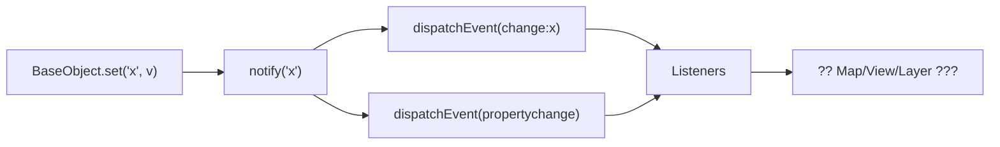
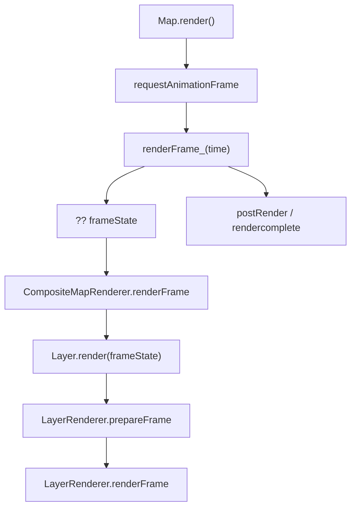
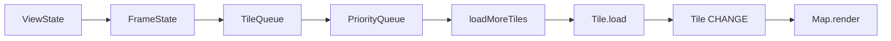
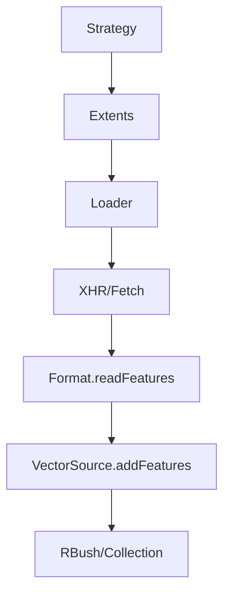
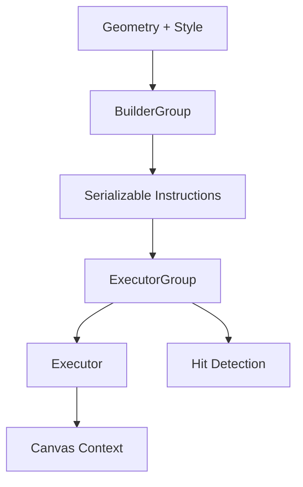
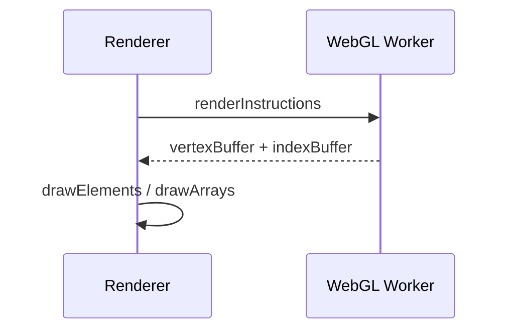

# OpenLayers 源码架构设计亮点（本仓库快照）

本文总结这个仓库里**值得学习的架构设计**，并给出“设计思路 + 实现位置 + 学习要点”。
适用于“由浅入深阅读源码”时做架构抓手。

> 说明：这是源码快照，仅包含 `src/`、`mini-src/`、`imgs/` 等子集目录。

---

## 1. 核心架构分层

### 1.1 可观察对象 + 事件系统（Observable / BaseObject）
**设计思路**
- 大量组件需要在状态变化时通知其它模块（Map、View、Layer、Source、Interaction）。
- 用统一的事件系统 + 可观察属性，避免组件之间直接依赖和回调链膨胀。

**实现方式**
- `events/Target` 自实现轻量 EventTarget（无捕获/冒泡层级）；
- `Observable` 提供 `on/once/un` 和 `changed()`；
- `BaseObject` 把属性存入 `values_`，提供 `set/get/unset`，并在 `change:prop` 和 `propertychange` 事件中通知。

**为什么值得学**
1. 既提供“对象整体变化”的 `change`，也提供“细粒度属性变化”的 `change:xxx`。
2. 事件 + 属性观察足以支撑 Map/UI/渲染的解耦架构。
3. 提供 `revision` 机制，便于做缓存失效判断。

**源码位置**
- `src/ol/events/Target.js`
- `src/ol/events.js`
- `src/ol/Observable.js`
- `src/ol/Object.js`
- `src/ol/ObjectEventType.js`

---

### 1.2 Map / View / Layer / Source 职责拆分
**设计思路**
- Map 负责“编排与生命周期”，View 负责“状态与约束”，Layer 负责“显示规则”，Source 负责“数据来源”。
- 每个模块只做一类事情，降低改动面与耦合度。

**实现方式**
- Map 构建 viewport、overlay 容器、事件处理与渲染循环；
- View 把 `center / resolution / rotation` 抽象为状态，并基于约束函数统一计算；
- Layer 持有 renderer，Source 只关心数据和加载逻辑。

**为什么值得学**
1. 架构清晰，便于扩展：新增 Layer/Source 不需要改 Map。
2. 设计上保留 “Map orchestration / View state / Layer rendering / Source data” 四段式。

**源码位置**
- `src/ol/Map.js`
- `src/ol/View.js`
- `src/ol/layer/Base.js`
- `src/ol/layer/Layer.js`
- `src/ol/source/Source.js`

---

### 1.3 LayerGroup 组合与状态合并
**设计思路**
- 图层需要分组并继承组级属性（透明度、可见性、范围、zIndex）。
- Group 本身也是 Layer，符合组合模式。

**实现方式**
- `LayerGroup` 维护 `Collection`，在添加/移除时发出 `addlayer/removelayer`。
- 在 `getLayerStatesArray` 时，把组级状态合并到子层。

**为什么值得学**
1. 组合模式 + 状态传播，允许树状结构的渲染管理。
2. Map 只处理 LayerGroup 状态数组即可，不关心层级深度。

**源码位置**
- `src/ol/layer/Group.js`

---

### 1.4 FrameState：统一渲染上下文
**设计思路**
- 渲染器不直接依赖 Map 的复杂状态，而依赖一个可复用的上下文快照。

**实现方式**
- Map 在 `renderFrame_` 中构建 `frameState`（viewState、layerStatesArray、tileQueue、transform 等）。
- Renderer 接收 `frameState` 进行绘制与命中检测。

**为什么值得学**
1. 明确“渲染输入”，方便缓存和测试。
2. 渲染器可复用，未来可扩展到其它渲染后端。

**源码位置**
- `src/ol/Map.js`
- `src/ol/renderer/Map.js`

---

### 1.5 Renderer 抽象与多后端
**设计思路**
- Map 层与 Layer 层不关心 Canvas / WebGL 的差别。
- 各层只负责“生成 renderer”，具体渲染细节隐藏在 renderer 内部。

**实现方式**
- `MapRenderer` 抽象渲染器；
- `CompositeMapRenderer` 负责排序与调度；
- `Layer.createRenderer()` 实例化具体渲染器（Canvas/WebGL）。

**为什么值得学**
1. 完成“渲染后端可替换”的架构基础。
2. 便于后续优化而不影响业务层。

**源码位置**
- `src/ol/renderer/Map.js`
- `src/ol/renderer/Composite.js`
- `src/ol/layer/Layer.js`
- `src/ol/layer/Vector.js`

---

### 1.6 View 约束函数化
**设计思路**
- 视图约束（中心/分辨率/旋转）可能有不同策略。
- 将约束抽象为函数，允许 View 调用时统一处理。

**实现方式**
- `createCenterConstraint / createResolutionConstraint / createRotationConstraint`
- `applyTargetState_` 中统一调用约束函数

**为什么值得学**
1. 复杂约束逻辑被策略化，清晰且可扩展。
2. Interaction 与动画共用同一约束逻辑。

**源码位置**
- `src/ol/View.js`
- `src/ol/centerconstraint.js`
- `src/ol/resolutionconstraint.js`
- `src/ol/rotationconstraint.js`

---

## 2. 渲染与性能设计

### 2.1 Canvas 指令录制 + 回放
**设计思路**
- 将渲染过程分为“指令生成”和“指令执行”，减少重复计算。

**实现方式**
- Builder 负责生成可序列化指令；
- Executor 负责重放；
- ExecutorGroup 负责按 zIndex 调度；
- Hit detection 复用同一套指令。

**为什么值得学**
1. 复用指令，显著减少实时计算开销。
2. 绘制与拾取逻辑一致，避免分叉。

**源码位置**
- `src/ol/render/canvas/BuilderGroup.js`
- `src/ol/render/canvas/Executor.js`
- `src/ol/render/canvas/ExecutorGroup.js`
- `src/ol/render/canvas/Instruction.js`

---

### 2.2 TileQueue：按优先级加载瓦片
**设计思路**
- 视图中“重要瓦片优先加载”，避免浪费带宽与绘制资源。
- 交互时降低并发，防止卡顿。

**实现方式**
- PriorityQueue 维护优先级；
- `getTilePriority` 以“视图中心距离 + 分辨率”计算优先级；
- Map 在交互/动画时降低并发阈值。

**为什么值得学**
1. 通过“加载策略 + 并发控制”优化交互体验。
2. 体现“渲染和资源加载”紧密协同的架构思路。

**源码位置**
- `src/ol/TileQueue.js`
- `src/ol/structs/PriorityQueue.js`
- `src/ol/Map.js`
- `src/ol/ViewHint.js`

---

### 2.3 缓存与资源生命周期
**设计思路**
- 地图渲染有大量资源（瓦片、图标等），必须可控释放。

**实现方式**
- LRUCache / TileCache 管理瓦片缓存；
- IconImageCache 管理样式资源；
- 渲染完成后统一触发过期。

**为什么值得学**
1. 缓存策略与渲染流程结合，防止内存泄露。
2. 以最小成本保证性能稳定。

**源码位置**
- `src/ol/structs/LRUCache.js`
- `src/ol/TileCache.js`
- `src/ol/style/IconImageCache.js`
- `src/ol/renderer/Map.js`
- `src/ol/Disposable.js`

---

### 2.4 WebGL Worker：CPU 密集型任务离线化
**设计思路**
- WebGL 顶点/索引生成属于 CPU 重负载，放在 worker 里避免卡顿。

**实现方式**
- Worker 接收指令、生成 buffer、回传 ArrayBuffer（transfer）。

**为什么值得学**
1. 主线程只负责渲染，交互更流畅。
2. 充分利用浏览器多线程能力。

**源码位置**
- `src/ol/worker/webgl.js`
- `src/ol/render/webgl/constants.js`
- `src/ol/render/webgl/utils.js`

---

### 2.5 统一命中检测路径
**设计思路**
- Canvas/WebGL 都需要“按像素拾取”，实现上尽量共用逻辑。

**实现方式**
- MapRenderer 提供统一的 `forEachFeatureAtCoordinate`；
- ExecutorGroup 在 Canvas 路径中使用“像素圆索引”优化命中检测。

**为什么值得学**
1. 命中检测与渲染共享上下文，降低维护成本。
2. 避免在 Map 层堆叠复杂判断。

**源码位置**
- `src/ol/renderer/Map.js`
- `src/ol/render/canvas/ExecutorGroup.js`

---

## 3. 数据与扩展架构

### 3.1 VectorSource 的 loader + strategy 模式
**设计思路**
- “加载哪些数据”与“如何加载数据”要解耦。

**实现方式**
- Strategy 返回需要加载的 extent；
- Loader 负责异步获取并解析；
- 通过事件反馈加载状态。

**为什么值得学**
1. 可快速扩展不同数据源与加载策略。
2. 避免把网络逻辑绑死在 Source 内部。

**源码位置**
- `src/ol/source/Vector.js`
- `src/ol/loadingstrategy.js`
- `src/ol/featureloader.js`

---

### 3.2 空间索引可插拔
**设计思路**
- 大数据量需要 R-Tree；小数据量则可能更轻量。

**实现方式**
- VectorSource 根据 `useSpatialIndex` 切换 RBush 或 Collection。

**为什么值得学**
1. 体现“可配置性能策略”。
2. 将索引逻辑封装为单一结构（RBush wrapper）。

**源码位置**
- `src/ol/structs/RBush.js`
- `src/ol/source/Vector.js`

---

### 3.3 Feature / Geometry / Style 解耦
**设计思路**
- Feature 只持有几何与属性；样式通过 style function 决定。
- 可随时切换渲染 geometry（geometryName）。

**实现方式**
- `Feature` 继承 BaseObject，geometry 作为属性；
- `createStyleFunction` 统一 style 入口。

**为什么值得学**
1. 数据结构与渲染逻辑彻底解耦。
2. 支持“同一 Feature 多种渲染方式”。

**源码位置**
- `src/ol/Feature.js`
- `src/ol/style/Style.js`

---

### 3.4 XML 解析的“对象栈”模式
**设计思路**
- XML 是树结构，但输出数据可能是对象、数组、混合结构。

**实现方式**
- `objectStack` 驱动解析过程；
- 通过 `pushParseAndPop`、`makeObjectPropertySetter` 等工具函数解耦解析逻辑。

**为什么值得学**
1. 可复用解析器，易扩展新格式。
2. 明确“解析结构”与“结果结构”之间的映射。

**源码位置**
- `src/ol/xml.js`
- `src/ol/format/readme.md`

---

## 4. 其它可学习的架构细节

### 4.1 统一的“唯一 ID”策略
**设计思路**
- 通过 `getUid` 保证对象的稳定 ID，避免重复索引与排序问题。

**源码位置**
- `src/ol/util.js`

### 4.2 开发期断言体系
**设计思路**
- 用统一错误码管理开发错误，便于定位问题。

**源码位置**
- `src/ol/asserts.js`
- `src/ol/AssertionError.js`

### 4.3 Disposable 生命周期管理
**设计思路**
- 大量对象需显式释放事件监听与资源，统一使用 `dispose()`。

**源码位置**
- `src/ol/Disposable.js`

---

## 5. 建议的“架构学习路径”

1. 事件系统与可观察对象：`Observable` → `BaseObject`  
2. Map / View / Layer / Source 关系  
3. FrameState 与渲染器抽象  
4. Canvas 指令录制/回放  
5. TileQueue 与性能调度  
6. VectorSource 的加载体系  

---

如果你希望我把每个设计点做成“阅读任务 + 实验验证 + 画图模板”，我可以继续补充为学习手册。

---

## 6. Mermaid ?????????
> ????????????? mental model???????????

### 6.1 ?????????

### 6.2 Map ?????

### 6.3 Tile ??????

### 6.4 VectorSource ????

### 6.5 Canvas ????/??

### 6.6 WebGL Worker ??

---

## 7. ??????????

### 1.1 ????? + ????
???????
- `src/ol/events/Target.js`
- `src/ol/Observable.js`
- `src/ol/Object.js`
?????
- ?? `BaseObject.set -> notify -> dispatchEvent` ??????????
- ?? `Observable.changed()` ? `Object.notify()` ??????
????
- ???? `set('foo', 1)` ??????????????
- Map ? `change:target` ???????????????

### 1.2 Map / View / Layer / Source ????
???????
- `src/ol/Map.js`
- `src/ol/View.js`
- `src/ol/layer/Layer.js`
- `src/ol/source/Source.js`
?????
- ? `Map` ??????? controls/interactions/overlays ?????
- ?? View ???? Map ??????????
????
- ? Source ???????????? Map ?????????

### 1.3 LayerGroup ???????
???????
- `src/ol/layer/Group.js`
- `src/ol/layer/Base.js`
?????
- ?? `getLayerStatesArray`????????opacity/visible/zIndex??
- ?? add/remove ??????????
????
- ? group.opacity=0.5?layer.opacity=0.8??? opacity ????
- ?? extent ??? extent ???????????

### 1.4 FrameState ???????
???????
- `src/ol/Map.js`
- `src/ol/renderer/Map.js`
?????
- ?? `frameState` ???????? 6 ????
- ?? `coordinateToPixelTransform` ? `pixelToCoordinateTransform` ????
????
- `size` ???? Map ?????? `renderFrame_` ?????

### 1.5 Renderer ??????
???????
- `src/ol/renderer/Map.js`
- `src/ol/renderer/Composite.js`
- `src/ol/layer/Layer.js`
?????
- ? `CompositeMapRenderer.renderFrame` ? zIndex ??????
- ?? `Layer.createRenderer()` ????????
????
- ????????? LayerRenderer????????????

### 1.6 View ?????
???????
- `src/ol/View.js`
- `src/ol/centerconstraint.js`
- `src/ol/resolutionconstraint.js`
- `src/ol/rotationconstraint.js`
?????
- ?? `applyTargetState_`??? rotation/resolution/center ??????
- ?? `resolveConstraints` ??????????
????
- ? `constrainResolution=true` ??`setResolution` ????????????

### 2.1 Canvas ???? + ??
???????
- `src/ol/render/canvas/BuilderGroup.js`
- `src/ol/render/canvas/Executor.js`
- `src/ol/render/canvas/ExecutorGroup.js`
?????
- ? VectorLayer renderer ??????????????
- ??????????????
????
- ???????????????? DRAW_IMAGE/CIRCLE??

### 2.2 TileQueue ?????
???????
- `src/ol/TileQueue.js`
- `src/ol/structs/PriorityQueue.js`
- `src/ol/Map.js`
?????
- ?? `getTilePriority`????????????
- ?? Map ???/?????????
????
- ??? zoom ???? tile ????????????

### 2.3 ?????????
???????
- `src/ol/structs/LRUCache.js`
- `src/ol/TileCache.js`
- `src/ol/style/IconImageCache.js`
?????
- ?? LRUCache ?????? TileCache ? `release()` ????
- ?? MapRenderer ???? icon cache ???
????
- TileCache.clear() ?????? `tile.release()`???????????

### 2.4 WebGL Worker ???
???????
- `src/ol/worker/webgl.js`
- `src/ol/render/webgl/constants.js`
- `src/ol/render/webgl/utils.js`
?????
- ?? `WebGLWorkerMessageType` ??????
- ?? renderInstructions ???? vertex/index buffer?
????
- ????? attributes ??? 2 ????buffer ????????

### 2.5 ????????
???????
- `src/ol/renderer/Map.js`
- `src/ol/render/canvas/ExecutorGroup.js`
?????
- ? `forEachFeatureAtCoordinate`?????? zIndex ???????
- ?? pixel circle ????????
????
- ?????????????????????

### 3.1 VectorSource ? loader + strategy
???????
- `src/ol/source/Vector.js`
- `src/ol/loadingstrategy.js`
- `src/ol/featureloader.js`
?????
- ?? `loadFeatures`??? strategy ? loader ????
- ?? `featuresloadstart/end/error` ??????
????
- ??????? loader ???????????? success/failure?

### 3.2 ???????
???????
- `src/ol/structs/RBush.js`
- `src/ol/source/Vector.js`
?????
- ?? `useSpatialIndex` ? false ???????
- ?? `getFeaturesInExtent` ??????????
????
- ?? API ? `useSpatialIndex=false` ?????????

### 3.3 Feature / Geometry / Style ??
???????
- `src/ol/Feature.js`
- `src/ol/style/Style.js`
?????
- ?? `setGeometryName` ??????????
- ?? `createStyleFunction` ??????
????
- ????????? Feature ? labelPoint ???????

### 3.4 XML ?????
???????
- `src/ol/xml.js`
- `src/ol/format/readme.md`
?????
- ?? `parseNode` ? `pushParseAndPop` ??????
- ?? `makeObjectPropertySetter` ????
????
- ? objectStack ???? `<Feature><id>..</id><Point>..</Point></Feature>` ??????

### 4.1 ???? ID?getUid?
???????
- `src/ol/util.js`
- `src/ol/source/Vector.js`
- `src/ol/structs/RBush.js`
?????
- ?? `getUid` ?????/????????
- ?? `uidIndex_` ? `idIndex_` ????
????
- ?? clone ????? uid ?????????????

### 4.2 ????
???????
- `src/ol/asserts.js`
- `src/ol/AssertionError.js`
?????
- ?? 2-3 ??? assert code ??????
- ?? AssertionError ? message ?????
????
- ?? error code 67 ??????????

### 4.3 Disposable ??????
???????
- `src/ol/Disposable.js`
- `src/ol/MapBrowserEventHandler.js`
- `src/ol/renderer/Map.js`
?????
- ?? disposeInternal ?????????
- Map target ?????????? dispose?
????
- ?? Map ?? DOM ????????????????
